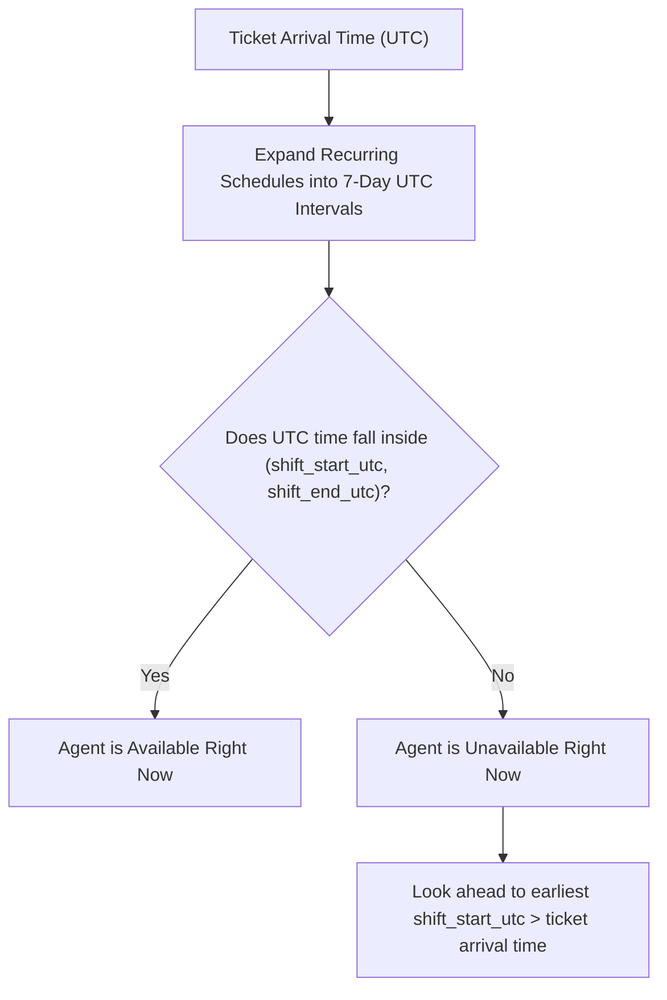
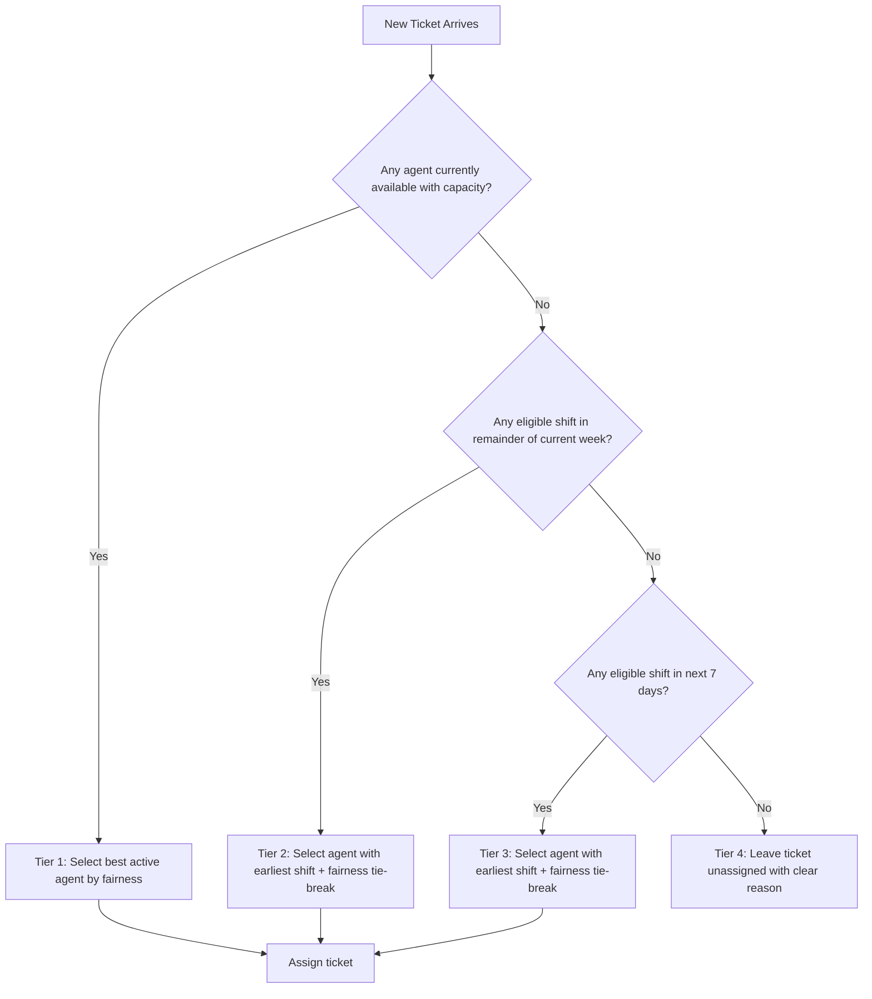

# Product Requirements Document
# Support Ticket Assignment

**Status:** Draft  
**Version:** 1.0  
**Last Updated:** 12 August 2026

---

# Part 1: Product Requirements

## 1. Overview

Support teams have agents who work different hours, on different days, and in different timezones.

Today, a team lead watches the incoming ticket queue and manually decides who should take each new ticket. This works for small teams but breaks down quickly as the team grows.

This product automatically assigns each new support ticket to the right available agent. It keeps workload fair, respects each agent's schedule, and explains every assignment decision clearly.

The system considers:

* Whether the agent is working right now
* How much work they already have
* How much work they can still reasonably take this week
* Whether they have had more than their fair share of work recently

The team lead can also see the full picture: who is available, who is busy, where there are gaps in coverage, and which tickets are waiting without an owner.

---

## 2. Problem Statement

The current manual assignment process creates several problems:

* Tickets sit unassigned when the team lead is offline or busy.
* The team lead spends their day triaging instead of doing their own work.
* Some agents get buried while others sit idle.
* Agents may receive new tickets even when they are fully loaded.
* Agents in different timezones may be assigned tickets outside their working hours.
* An agent with a higher weekly capacity handles more absolute work, but a system that only counts tickets treats that unfairly.
* Even if an agent is under capacity this week, they may have carried most of the load over the past few weeks.
* Team leads have no easy way to see when the team does not have enough people available to handle incoming work.
* There is no record of why a particular agent was chosen for a ticket.

The goal is to automate assignment in a way that is fair, transparent, and easy for the team lead to understand and manage.

---

## 3. Goals

### Primary Goals

1. Automatically assign new tickets to an available agent.
2. If no agent is working right now, look ahead through the upcoming 7 days and assign the ticket to the agent scheduled to work earliest.
3. Never assign a ticket to an agent who does not have enough remaining capacity.
4. Distribute work fairly, both right now and over time.
5. Explain every assignment in plain language.
6. Show the team lead when no one is available or able to take a ticket.
7. Show the team lead which tickets are waiting without an owner.

### Success Criteria

A successful system makes these statements true:

* A ticket is assigned automatically when an eligible agent is available.
* Tickets arriving off-hours or on weekends are assigned to the agent starting work earliest in the upcoming days.
* An agent who cannot fit the ticket into their remaining capacity is never selected.
* An agent who has carried more work than others recently is less likely to be selected.
* An agent with a higher weekly capacity can fairly handle more absolute work.
* Every assignment includes a plain-language explanation.
* If no one can take a ticket (even looking ahead to their capacity in the upcoming 7 days), the ticket stays unassigned with a clear reason.
* The team lead can see current coverage, capacity, and any gaps at a glance.
* Unassigned tickets are visible to the team lead.

---

## 4. Target Users

### Team Lead

The team lead manages the support team. They are the primary user of the management UI.

They need to:

* Add and edit agents on their team.
* Set each agent's timezone and availability schedule.
* Set company workdays and ticket effort values in Settings.
* Set each agent's weekly capacity.
* See who is currently available and who is not.
* See which time windows have no coverage.
* See which tickets are unassigned and why.
* Understand why each ticket was assigned to a particular agent.

### Support Agent

An agent receives and resolves tickets.

They have:

* A timezone.
* A weekly availability schedule (which days they work and what hours).
* A weekly ticket capacity.
* A current set of active tickets.

Agents are not expected to use the management UI directly. The team lead manages their settings.

---

## 5. Scope

### In Scope

#### Settings Management

* Set company workdays (which days of the week the company operates).
* Set default effort values (in hours) for each ticket priority level.
* Set company timezone.

#### Agent Management

* Create and edit agents.
* Set agent timezone.
* Set agent availability (per-day, each day can have a different time window).
* Set agent weekly ticket capacity.

#### Tickets

Each ticket has:

* Company it belongs to.
* Priority (P1, P2, P3, P4).
* Status (Open, In Progress, Resolved, Closed).
* Estimated effort (derived from configured priority settings).
* Assignee (empty if unassigned).
* Assignment timestamp (`assigned_at` - when the system made the decision).
* Target shift start (`target_shift_start` - when the system expects the work to begin, crucial for look-ahead assignments. For immediate Tier 1 assignments, this is exactly equal to `assigned_at`).
* Assignment reason.

#### Assignment Engine

* Finds agents belonging to the company.
* Checks whether each agent is currently working.
* If no agent is working right now, looks ahead to the upcoming 7 days to assign it to the agent scheduled earliest who has capacity.
* Calculates how much capacity each agent has left.
* Compares candidates using projected and rolling utilization.
* Assigns the ticket to the best eligible candidate.
* Records the assignment with a plain-language reason.
* Returns the assigned agent and the reason.

If no agent can take the ticket even when looking ahead:

* The ticket stays unassigned.
* A clear reason is recorded.
* The gap is visible to the team lead.

#### Coverage View

The UI shows:

* Which agents are currently available.
* Which agents are currently unavailable and why (outside working hours, at capacity).
* Which time windows have no coverage for any ticket priority.
* A warning when no agent can take any ticket right now.
* Unassigned tickets with their recorded reasons.

### Out of Scope

The following are intentionally excluded from this version:

* Authentication and login.
* Roles and permissions.
* Billing.
* Multiple support teams within one company.
* Mobile applications.
* Holiday calendars.
* PTO tracking.
* One-off availability overrides.
* Multiple availability blocks on the same day.
* Email or Slack notifications.
* Agent skills, domains, or expertise.
* AI ticket classification.
* Machine learning of any kind.
* Automatic effort prediction from historical data.

---

## 6. Assumptions

The table below lists the decisions made for this version of the product. These keep the system simple and focused.

| Area | Decision |
|---|---|
| Teams | One support team per company |
| Agents | Multiple agents in a Team |
| Company settings | Configurable via Settings (workdays, default ticket efforts, company timezone) |
| Availability | One time block per day; each day can have a different start and end time |
| Agent timezone | Each agent has an IANA timezone (e.g., Asia/Kolkata) |
| Capacity unit | Hours per week |
| Workload unit | Estimated hours per ticket, based strictly on configurable priority defaults (no per-ticket override) |
| Priority labels | P1 (critical), P2 (high), P3 (normal), P4 (low) |
| Ticket handling | Every agent can handle every ticket |
| Fairness (short term) | Projected utilization after assignment |
| Fairness (long term) | Rolling utilization over available working days (not calendar days) |
| Rolling window | Previous 30 available working days per agent. (An *available working day* is a calendar date on which the agent has at least one scheduled availability block AND the date is a company workday). |
| Tickets | Assumed to be pre-created with company, priority, and status set; the API consumes them |
| P1 override | P1 does not override capacity or availability rules |
| Already-assigned tickets | If a ticket already has an assignment, the API returns the existing assignment without creating a new one |

### Availability vs. Fairness Trade-Off

This system makes an explicit product decision to prioritize **Availability (Earliest Response)** over absolute **Fairness**. 

* **If we prioritized Fairness:** The system would evaluate all agents across the entire week and assign the ticket to the absolute least loaded agent. This would perfectly balance the workload, but if that least loaded agent doesn't start their next shift until three days later, the ticket sits untouched for three days.
* **Because we prioritize Availability:** The system greedily assigns tickets to the agent working *earliest* (or currently active). This means if only one agent is working on a Sunday night, they will absorb all tickets until their capacity is full, even if agents logging in on Monday morning have zero workload. 

Availability determines the assignment tier. Within the active tier, fairness determines which eligible agent should receive the ticket. For look-ahead tiers, earliest shift start takes precedence, and fairness is used only when multiple eligible agents have the same earliest shift start.

---

## 7. Company Workdays

### What Are Company Workdays?

Company workdays define which days of the week the company expects its support team to be operating.

The team lead configures this in Settings. For example:

* **Company:** Acme Corp
* **Timezone:** America/New_York
* **Workdays:** Monday, Tuesday, Wednesday, Thursday, Friday

### Why This Matters

Company workdays serve two purposes.

**Coverage:** If the company operates Monday to Friday and no agent is available on Wednesday afternoon, the system flags and shows that as a coverage gap.

**Agent-Local Planning Week:** To prevent mid-shift capacity resets, the planning week is calculated using the company's first workday, but starts at midnight in each *agent's local timezone*. For example, if the company runs Monday to Friday, Ananya's week starts Monday at midnight IST, and Rohan's starts Monday at midnight EST.

---

## 8. Agent Availability

### Definition

Availability answers the question: When is this agent scheduled to be working?

Each agent has a recurring weekly schedule. The system supports one availability block per day. Each day can have a different time window.

### Example

* **Agent:** Ananya
* **Timezone:** Asia/Kolkata

* **Monday:** 09:00 - 17:00
* **Tuesday:** 09:00 - 17:00
* **Wednesday:** 12:00 - 20:00 (afternoon shift)
* **Thursday:** 09:00 - 17:00
* **Friday:** 09:00 - 13:00 (half day)
* **Saturday:** Unavailable
* **Sunday:** Unavailable

Notice:
* Wednesday has a different start time than the rest of the week.
* Friday is only a half day.
* Each day is configured independently.

### Another Example (Two Agents, Different Schedules)

* **Agent:** Rohan
* **Timezone:** America/New_York

* **Monday:** 14:00 - 22:00
* **Tuesday:** 14:00 - 22:00
* **Wednesday:** 14:00 - 22:00
* **Thursday:** 14:00 - 22:00
* **Friday:** 14:00 - 22:00
* **Saturday:** Unavailable
* **Sunday:** Unavailable

Ananya covers mornings in India. Rohan covers afternoons in New York. Together, they provide longer combined coverage.

### How the System Evaluates Availability (UTC Shift Expansion)

To handle timezone differences, daylight saving shifts, overnight (cross-midnight) shifts, and multi-week boundaries without complex edge cases, the system uses **UTC Shift Expansion**:

1. When evaluating current availability or the upcoming 7-day look-ahead window, the system takes each agent's local recurring schedule (day of week, start time, end time, timezone).
2. It constructs concrete local shift intervals for the 7-day window. If a shift crosses midnight (e.g., Monday 22:00 to Tuesday 06:00), the end time extends into the next calendar day.
3. It converts these local intervals into absolute UTC timestamp ranges `(shift_start_utc, shift_end_utc)`.



This single pattern solves overnight shifts, timezone conversions, and next-week look-ahead calculations on one unified UTC timeline.

A day with no availability block means the agent is not working that day.

---

## 9. Timezones

Each agent has an IANA timezone. This is a named timezone like:

* Asia/Kolkata
* America/New_York
* Europe/London
* Australia/Sydney

The system always stores and processes timezones by name, not by a fixed UTC offset. This is important because UTC offsets change with daylight saving time. Using the timezone name ensures the schedule stays correct through the year.

### Company Timezone

In addition to agent timezones, the company has one timezone. This is used for:

* Defining the planning week boundary (e.g., Monday starts at midnight company-local time).
* Coverage display in the team lead UI.

### What Happens If a Timezone Is Updated

If an agent's timezone is updated, all future availability checks use the new timezone. Assignments already made are not changed.

---

## 10. Ticket Priority and Effort

Tickets have four priority levels. The default effort values (in hours) are configurable from the Settings dashboard:

| Priority | Label | Default Effort (Configurable) |
|---|---|:---:|
| P1 | Critical | 8h |
| P2 | High | 4h |
| P3 | Normal | 2h |
| P4 | Low | 1h |

These effort values are estimates, not promises about resolution time. They give the system a consistent way to compare how heavy different tickets are. A P1 ticket is estimated to take eight times as long as a P4 ticket.

**Important:** Ticket effort is strictly determined by its priority using the global company settings. Individual tickets cannot override this effort value.

### Why Priority Matters for Assignment

Priority determines how much capacity the ticket will consume when assigned, and affects whether an agent has enough effective remaining capacity to take it.

For example, if Ananya only has 3 hours of effective remaining capacity, she cannot take a P1 ticket (which costs 8h) but she can take a P4 ticket (which costs 1h).

---

# Part 2: Assignment Algorithm

## 11. Capacity

### Definition

Capacity answers the question: How much ticket work can this agent reasonably handle in a week?

Each agent has a weekly ticket capacity in hours. This is set by the team lead.

Availability and capacity are separate settings:

* **Agent:** Ananya
* **Availability:** 40h/week (scheduled working hours)
* **Ticket capacity:** 32h/week (how much of that can be ticket work)

The difference (8h in Ananya's case) represents meetings, reviews, internal work, breaks, and other responsibilities.

### Agents Can Have Different Capacities

* Ananya: 32h/week
* Rohan: 40h/week
* Sarah: 24h/week

This is expected and fair. An agent with a higher capacity can handle more absolute work. The system accounts for this by comparing workload as a percentage of capacity, not as an absolute number.

---

## 12. Workload

### Active Workload

Active workload is the estimated effort of all tickets the agent is currently working on (status is Open or In Progress).

> **Important:** Active workload is a visibility metric, not a capacity-budget metric. A ticket consumes capacity *only* in the planning week associated with its `target_shift_start`. If a ticket remains open in subsequent weeks, its remaining effort does not automatically consume the next week's capacity, because this system intentionally models fixed assignment estimates rather than tracking remaining-work estimates.

* **Agent:** Ananya
* **Open tickets:**
  * Ticket #101: P1 (8h)
  * Ticket #102: P3 (2h)
* **Active workload:** 10h

### Weekly Workload

Weekly workload is the total estimated effort of all tickets whose `target_shift_start` falls into the specific planning week being evaluated, regardless of their current status.

* **Agent:** Ananya (Evaluating Week 2 Capacity)
* **Assigned to Week 2:**
  * Ticket #101: P1 (8h) (Assigned yesterday via look-ahead for Monday morning)
  * Ticket #099: P2 (4h) (Assigned today for Tuesday)
* **Weekly workload for Week 2:** 12h

By scoping workload to the `target_shift_start` rather than the exact moment the ticket arrived, the system natively handles **look-ahead reservations**. A ticket assigned on a Saturday for a Monday shift immediately consumes capacity from Monday's week, leaving Saturday's week completely untouched.

Resolved tickets no longer count toward active workload, but they still count toward weekly workload. The work happened, so it should remain part of the fairness calculation.

### Ticket Status and Workload

| Status | Counts as Active Workload? | Counts as Weekly Workload? |
|---|:---:|:---:|
| Open | Yes | Yes |
| In Progress | Yes | Yes |
| Resolved | No | Yes |
| Closed | No | Yes |

---

## 13. Remaining Capacity

### Weekly Remaining Capacity

```
Remaining weekly capacity = weekly capacity - weekly workload (for the evaluated week)
```

Example:

* **Ananya:**
  * Weekly capacity: 32h
  * Weekly workload: 20h
  * Remaining: 12h

### Why Remaining Weekly Capacity Is Not Enough

Ananya has 12h of remaining weekly capacity. But if today is Friday at 15:00 and she finishes at 17:00, she only has 2 working hours left this week.

It would not be sensible to assign 10h of new work to Ananya at that point, even though she technically has 12h remaining on her weekly budget.

This is why the system also considers how many scheduled working hours remain in the week.

---

## 14. Effective Remaining Capacity

Effective remaining capacity combines two signals:

1. **Remaining weekly capacity:** What is left in the weekly budget.
2. **Time-supported remaining capacity:** How much work can realistically fit into the remaining scheduled hours.

### Capacity Rate

First, we calculate the proportion of scheduled hours that go to ticket work:

```
Capacity rate = weekly ticket capacity / total weekly availability hours
```

Example:

* **Ananya:**
  * Weekly availability: 40h
  * Weekly ticket capacity: 32h
  * Capacity rate: 32 / 40 = 0.80

This means 80% of Ananya's scheduled time is available for ticket work.

### Time-Supported Remaining Capacity

We apply this rate to the remaining scheduled hours:

```
Time-supported remaining capacity = remaining scheduled hours * capacity rate
```

Example (Wednesday afternoon):

* **Ananya's remaining schedule this week:**
  * Wednesday: 4h remaining today
  * Thursday: 8h
  * Friday: 8h
  * Total remaining: 20h
  * Time-supported capacity: 20 * 0.80 = 16h

### Effective Remaining Capacity

```
Effective remaining capacity = min(remaining weekly capacity, time-supported remaining capacity)
```

We take the lower of the two values to be conservative.

* Remaining weekly capacity: 12h
* Time-supported remaining capacity: 16h
* Effective remaining capacity: 12h

Ananya can reasonably take up to 12h more of ticket work this week.

### Full Example

Suppose today is Thursday. Ananya's situation:

* **Ananya:**
  * Timezone: Asia/Kolkata
  * Weekly capacity: 32h
  * Weekly workload: 20h so far
  * Remaining schedule:
    * Thursday: 09:00 - 17:00 (8h)
    * Friday: 09:00 - 13:00 (4h)
    * Total remaining scheduled: 12h
  * Capacity rate: 32 / 40 = 0.80
  * Time-supported capacity: 12 * 0.80 = 9.6h
  * Effective remaining capacity: min(12, 9.6) = 9.6h

Ananya can take a P1 ticket (8h) but not two P1 tickets.

---

## 15. Fairness

### What Fairness Means

Fair does not mean every agent gets the same number of tickets.

It means: Work should be reasonably balanced relative to each agent's capacity, both right now and over recent weeks.

An agent with a 40h weekly capacity carrying 30h of work is as loaded as an agent with a 20h capacity carrying 15h of work. Both are at 75% utilization.

### Two Fairness Signals

The system uses two signals:

1. **Projected utilization:** Short-term fairness. How loaded will this agent be if they take this ticket?
2. **Rolling utilization:** Long-term fairness. Has this agent received more than their fair share over recent weeks?

---

## 16. Projected Utilization

Projected utilization asks the question: What will this agent's workload look like after they take this ticket?

```
Projected utilization = (weekly workload + ticket effort) / weekly capacity
```

Example:

* **Ananya:**
  * Weekly capacity: 40h
  * Weekly workload: 10h
  * New P2 ticket: 4h
  * Projected: (10 + 4) / 40 = 35%

The system prefers candidates with lower projected utilization because they will be less loaded after the assignment.

### Why This Matters for Agents With Different Capacities

* **Ananya:** Capacity 40h, workload 16h
* **Rohan:** Capacity 40h, workload 20h
* **Sarah:** Capacity 60h, workload 24h

New P2 ticket: 4h

Projected utilizations:
* Ananya: (16 + 4) / 40 = 50.0%
* Rohan: (20 + 4) / 40 = 60.0%
* Sarah: (24 + 4) / 60 = 46.7%

Sarah has more absolute workload than Ananya, but also has more capacity. Projected utilization correctly identifies Sarah as the least loaded candidate for this ticket.

---

## 17. Rolling Utilization

### Why We Need It

Projected utilization only looks at the current planning week. This is not enough.

Imagine Ananya had a heavy three weeks while Rohan and Sarah had lighter ones. Even if Ananya starts a new week with zero workload, repeatedly assigning her tickets because her current utilization looks low is not fair.

Rolling utilization looks at history to prevent this from happening.

### Measured in Available Days, Not Calendar Days

The rolling window covers the **previous 30 available working days for each agent**.

> **Attribution Rule:** For rolling utilization, ticket effort is attributed to the agent's available working day containing the `target_shift_start`. 

This ensures perfect historical consistency: Weekly utilization maps to the target shift *week*, and Rolling utilization maps to the target shift *working day*.

This is important:

* An agent who works five days a week accumulates 30 available days in six calendar weeks.
* An agent who works three days a week takes ten calendar weeks to accumulate 30 available days.
* A new agent who joined recently has fewer available days, and their rolling utilization reflects only the time they have been active. **If an agent has fewer than 5 available working days of history, their rolling utilization defaults to the team's current average (or 0% if the entire team is new and has no history).** This prevents the system from flooding new agents with tickets on their first day just because their historical workload is zero.

We use available days rather than calendar days because comparing agents with different weekly schedules over the same calendar period would be unfair.

### Calculation

```
Rolling utilization =
    total estimated effort assigned in the previous 30 available days
    divided by
    (capacity rate * total scheduled hours in those 30 days)
```

Example:

* **Ananya:** Past 30 available days
  * Scheduled hours: 160h
  * Capacity rate: 0.80
  * Expected ticket hours: 160 * 0.80 = 128h
  * Actual assigned effort: 105h
  * Rolling utilization: 105 / 128 = 82%
* **Rohan:** Past 30 available days
  * Scheduled hours: 160h
  * Capacity rate: 1.00
  * Expected ticket hours: 160h
  * Actual assigned effort: 88h
  * Rolling utilization: 88 / 160 = 55%

Even if Ananya and Rohan have similar current weekly workloads, the system prefers Rohan for the next ticket because Ananya has carried significantly more load recently.

---

## 18. Assignment Eligibility

Before fairness is considered, an agent must pass three hard checks:

1. **Company:** The agent belongs to the same company as the ticket.
2. **Availability:** The agent is currently within their scheduled working hours.
3. **Capacity:** The agent's effective remaining capacity is greater than or equal to the ticket's estimated effort.

### Target Shift Capacity Budgeting

For look-ahead assignments, capacity is evaluated against and deducted from the planning week **to which the target shift belongs**, NOT the planning week in which the ticket arrived.

* **Example:** A ticket arrives on Friday at 23:00 UTC (end of Week 1). Ananya has 0h remaining in Week 1. The look-ahead engine evaluates Ananya's upcoming shift on Monday at 09:00 IST (start of Week 2).
* **System Behavior:** The system evaluates Ananya's **Week 2 capacity budget** (which is 32h). Since 32h $\ge$ 8h (P1), Ananya is eligible. When assigned, the 8h effort is deducted from Ananya's **Week 2 budget**.

This rule prevents timezone lag and weekend boundary overlaps from incorrectly evaluating an upcoming shift against an expiring week's depleted budget.

If any check fails, the agent is excluded from immediate active assignment.

---

## 19. Assignment Logic

The engine uses a tiered selection process (**Earliest Eligible Assignment**) to find the right agent:

1. **Tier 1: Immediate Active Assignment**
   * Check agents currently working right now.
   * If eligible candidates with sufficient effective capacity exist, select the best candidate using short-term and long-term fairness metrics (projected utilization, then rolling utilization).

2. **Tier 2: Current Week Look-Ahead**
   * If no agent currently working is eligible, look ahead through the remainder of the current planning week.
   * Select the agent scheduled for the earliest upcoming shift who has sufficient remaining capacity for the week.
   * If multiple agents share the earliest upcoming shift start time, apply fairness tie-breakers to select among them.

3. **Tier 3: 7-Day Look-Ahead**
   * If no eligible assignment exists in the remainder of the current planning week, look ahead into the next planning week (up to 7 days from ticket arrival time).
   * Select the agent scheduled for the earliest shift with sufficient capacity. If start times tie, apply fairness tie-breakers.

4. **Tier 4: Unassigned State**
   * If no agent has capacity within the 7-day look-ahead window, leave the ticket unassigned with a recorded reason.



### Tie-Breaking Rules

When multiple candidates are ranked at any tier, ties are resolved in this order:

1. **Lowest projected utilization** (evaluated with a 10% threshold). If candidates are within 10% of each other, they are considered tied. This prevents insignificant short-term differences from overriding massive long-term workload imbalances.
2. **Lowest rolling utilization** (30 available days).
3. **Least recently assigned a ticket** (based on `last_assigned_at`, the global timestamp of the most recent ticket assignment to the agent, regardless of ticket status or planning week).
4. **Deterministic tie-break** based on agent ID (alphabetical sort).

---

## 20. Assignment Examples

### Example 1: Normal Assignment (Active Hours)

A P2 ticket arrives on a Wednesday morning.

* **Ticket:** P2 (effort 4h)

Candidates after eligibility checks:

| Agent | Capacity | Weekly Work | Projected Util | Rolling Util |
|---|---:|---:|---:|---:|
| Ananya | 40h | 16h | 50.0% | 82% |
| Rohan | 40h | 20h | 60.0% | 55% |
| Sarah | 60h | 24h | 46.7% | 60% |

Sarah has the lowest projected utilization. The ticket is assigned to Sarah.

**Reason recorded:**

> Assigned to Sarah. Selected via lowest projected utilization (46.7%) among 3 eligible active candidates.

---

### Example 2: Long-Term Fairness

A P3 ticket arrives on a Monday morning.

* **Ticket:** P3 (effort 2h)

Candidates:

| Agent | Capacity | Weekly Work | Projected Util | Rolling Util |
|---|---:|---:|---:|---:|
| Ananya | 40h | 0.4h | 6.0% | 88% |
| Rohan | 40h | 0h | 5.0% | 51% |

Ananya and Rohan have slightly different projected utilizations (6.0% vs 5.0%). However, because they are within the 10% threshold of each other, the system considers them tied for short-term workload. It falls back to rolling utilization. Rohan has carried significantly less work over recent weeks.

**Reason recorded:**

> Assigned to Rohan. Projected utilization was tied (within 10% threshold). Selected via lowest 30-day rolling utilization (51% vs 88%) among 2 eligible active candidates.

---

### Example 3: Fallback Assignment (Outside Working Hours / Weekend)

A P1 ticket arrives on a Saturday afternoon. The company does not operate on weekends.

* **Ticket:** P1 (effort 8h)

No agents are currently working. The system looks ahead to the upcoming 7 days:

* Ananya: Next shift starts Monday at 09:00 local time (Monday 03:30 UTC).
* Rohan: Next shift starts Monday at 14:00 local time (Monday 19:00 UTC).
* Both have sufficient capacity.

Ananya is scheduled to work earliest. The ticket is assigned to Ananya.

**Reason recorded:**

> Assigned to Ananya. No active agents available. Selected via earliest eligible upcoming shift (Monday 09:00 IST).

---

### Example 4: Unassigned Ticket (Total Capacity Exceeded)

A P1 ticket arrives on a Friday afternoon.

* **Ticket:** P1 (effort 8h)
* Ananya: Outside working hours.
* Rohan: Working, but has only 2h of effective remaining capacity.
* Sarah: Outside working hours.

The system looks ahead through the upcoming 7 days. However:
* All agents have already filled their capacity limits for all shifts in the upcoming 7 days (e.g., due to a backlog).

**Result:** Ticket remains unassigned.

**Why Not Keep Looking Ahead?**
The look-ahead is strictly capped at the upcoming 7 days. The system explicitly does not support an infinite backlog (e.g., assigning a ticket to an agent's capacity 3 weeks from now). This acts as a critical safety valve. Assigning a customer's ticket today to someone three weeks in the future is a poor customer experience. By leaving it Unassigned, the team lead immediately sees a warning that the team is completely maxed out and they need to intervene (e.g., hire more people, approve overtime, or temporarily increase capacity limits).

**Reason recorded:**

> Not assigned. No eligible agent found. Rohan is currently working but has only 2h of remaining capacity. Ananya and Sarah are outside working hours, and no agent has sufficient effective capacity in their upcoming scheduled shifts for the next 7 days to absorb a P1 ticket (8h).

---

## 21. Sticky Assignments & Already-Assigned Tickets

### Sticky Assignment Rule

Once a ticket has been assigned to an agent, the assignment is **sticky**. 

Changes to an agent's schedule, availability, timezone, weekly capacity, or company settings do not automatically trigger a re-assignment or un-assign existing tickets. Settings updates apply strictly to future ticket assignment decisions. Re-assignment of an existing ticket must be an explicit, manual action performed by a team lead.

### Idempotent API Behavior

If the assignment API is called for a ticket that already has an assigned owner, the system returns the existing assignment details as-is. It does not re-run the assignment algorithm or change the assignee.

```json
{
  "ticket_id": "ticket_123",
  "status": "assigned",
  "agent_id": "agent_42",
  "agent_name": "Ananya",
  "assigned_at": "2026-08-12T09:14:00Z",
  "reason": "Ananya had the lightest workload relative to their capacity among available agents.",
  "note": "This ticket was already assigned. Existing assignment returned."
}
```

This prevents duplicate API requests from altering an active owner or shifting tickets between agents.

---

## 22. Assignment Explanation

Every outcome, whether the ticket was assigned right away, assigned via look-ahead, or left unassigned, stores a plain-language reason. This reason is visible to the team lead.

### Assigned: Active Shift Example

> Assigned to Rohan. Selected via lowest projected utilization (37.5%) among 3 eligible active candidates.

### Assigned: Off-Hours Fallback Example

> Assigned to Ananya. No active agents available. Selected via earliest eligible upcoming shift (Monday 09:00 IST).

### Unassigned Example

> Unassigned. 0 eligible candidates found. All active and upcoming shifts for the next 7 days lack sufficient capacity to absorb 8h of effort.

---

## 23. Coverage View

The team lead interface displays real-time and scheduled coverage.

### Current Status Panel

```
Current Coverage: Wednesday, 12 Aug, 14:30 IST

Agents scheduled today:   5
Currently available:      3
Currently unavailable:    2
  * Ananya: Shift ends at 17:00 IST (2.5h remaining)
  * Rohan: Shift starts at 16:00 IST (not yet started)

Available Capacity:
  P1 tickets (8h): 1 agent can take one   [Ananya: 9h remaining]
  P2 tickets (4h): 2 agents can take one  [Ananya, Sarah]
  P3 tickets (2h): 3 agents can take one  [Ananya, Sarah, Vikram]
  P4 tickets (1h): 3 agents can take one  [Ananya, Sarah, Vikram]

Overall status: Covered
```

### Coverage Gap Capacity Warning

If agents are working but their capacity is spent, the dashboard highlights this warning:

```
Current Coverage: Wednesday, 12 Aug, 20:30 IST

Agents scheduled today:   5
Currently available:      2
Currently unavailable:    3

Available Capacity:
  P1 tickets (8h): Warning: No agent has enough capacity
  P2 tickets (4h): Warning: No agent has enough capacity
  P3 tickets (2h): 1 agent can take one   [Sarah: 3h remaining]
  P4 tickets (1h): 2 agents can take one  [Sarah, Vikram]

Overall status: Partial: cannot handle P1 or P2 tickets right now
```

### No Coverage Alert

If no agents are working and there are no look-ahead fallback schedules:

```
Current Coverage: Sunday, 9 Aug 2026, 10:00 IST

Agents scheduled today:   0
No agents are working right now.

Overall status: No Coverage
```

---

## 24. Unassigned Tickets View

The team lead has a dedicated panel showing tickets that could not be assigned to any agent (even through fallback logic).

```
Unassigned Tickets (3)

------------------------------------------------------------
Ticket #201  |  P1  |
Reason: All agents are outside working hours. No look-ahead shifts scheduled for the upcoming 7 days.
------------------------------------------------------------
Ticket #198  |  P2  |
Reason: Rohan and Sarah are available but both at capacity. Ananya is outside working hours.
------------------------------------------------------------
Ticket #195  |  P3  |
Reason: No agents configured for this company.
------------------------------------------------------------
```

---

## 25. Assignment API

### Endpoint

```http
POST /companies/{company_id}/tickets/{ticket_id}/assignment
```

The system reads the ticket state and assigns an owner.

### Response: Assigned Immediately

```json
{
  "ticket_id": "ticket_123",
  "status": "assigned",
  "agent_id": "agent_42",
  "agent_name": "Ananya",
  "assigned_at": "2026-08-12T09:14:00Z",
  "reason": "Ananya was available, had 9h of effective remaining capacity, and had the lowest projected utilization among available agents (35%)."
}
```

### Response: Assigned via Look-Ahead Fallback

```json
{
  "ticket_id": "ticket_124",
  "status": "assigned",
  "agent_id": "agent_42",
  "agent_name": "Ananya",
  "assigned_at": "2026-08-12T22:00:00Z",
  "reason": "No agent was available at arrival time. Ananya was selected because their next working shift starts earliest (Monday 09:00 Asia/Kolkata) among eligible agents."
}
```

### Response: Unassigned

```json
{
  "ticket_id": "ticket_125",
  "status": "unassigned",
  "reason": "No eligible agent found. Rohan and Sarah are outside their working hours. Ananya has 3h effective remaining capacity but the ticket requires 8h (P1), and no upcoming shifts have sufficient capacity."
}
```

---

## 26. Main User Flows

### Add or Edit an Agent

1. Go to the Agents page.
2. Click Add Agent or select an existing one.
3. Fill in the agent's name, timezone, and weekly ticket capacity.
4. Save.

### Configure Agent Availability

1. Open the agent's detail page and go to Availability.
2. For each day of the week, toggle it on or off.
3. If the day is on, set the start time and end time.
4. Save.

Each day can have a different start and end time. One block per day is supported.

### Configure Company Settings

1. Go to Settings.
2. Select which days the company operates (company workdays).
3. Set the default effort in hours for each ticket priority level (P1, P2, P3, P4).
4. Set the company timezone.
5. Save.

---

## 27. Edge Cases

| Scenario | System Behavior |
|---|---|
| Agent is outside working hours | Check fallback look-ahead. If active agents are working, skip this agent. If no one is working, evaluate this agent's next shift. |
| Agent is at capacity | Exclude from current ticket assignment. |
| Agent has weekly capacity remaining but no working hours left this week | Effective remaining capacity is 0. Skip for current week, evaluate against their next scheduled shift if look-ahead fallback runs. |
| Ticket effort is larger than any agent's weekly capacity | Ticket remains unassigned. Reason indicates the ticket size exceeds maximum agent capacity settings. |
| All agents are unavailable and no upcoming shifts exist | Ticket remains unassigned. |
| Multiple candidates have equal projected utilization | Fall back to rolling utilization (30 available days). |
| Multiple candidates have equal rolling utilization | Assign to the agent who was least recently assigned a ticket. |
| Still equal after all tie-breaks | Deterministic sort based on agent ID. |
| Ticket already has an assignment | Return the existing assignment details immediately. |
| Agent's availability or timezone is updated | Future assignments use the new schedule. Active assignments are unchanged. |
| Ticket is resolved or closed | Remove its effort from active workload. Retain it in weekly workload and rolling utilization history. |

---

# Part 3: Technical Constraints

## 28. Non-Functional Requirements

### Correctness

Availability and capacity calculations must be accurate across timezones. The system must convert times correctly and handle daylight saving time changes using named IANA timezone databases.

### Explainability

Every assignment decision (including fallbacks and unassigned states) must record a clear, plain-language reason.

### Determinism

Given the same system state and ticket details, the assignment engine must produce the same result. Random selections are prohibited.

### Consistency

A ticket must never be assigned to more than one agent. Concurrent assignment requests must be handled safely using database transactions or lock mechanisms.

---

## 29. Future Improvements

* **Emergency P1 Override:** Allow the team lead to manually force-assign a P1 ticket to an agent, overriding capacity or availability rules.
* **Multiple Availability Blocks Per Day:** Support agents who work split shifts (e.g., morning and evening blocks).
* **Holiday Calendars and PTO:** Mark specific dates as unavailable without altering recurring weekly schedules.
* **Agent Skills and Expertise:** Introduce a skill or product-expertise layer so the system can prefer agents with relevant knowledge for specific ticket domains.
* **AI Ticket Classification:** Use machine learning to read ticket details and automatically determine priority and effort.
* **Workforce Forecasting:** Analyze volume trends to recommend schedule optimizations.

---

## 30. Decision Summary

1. One support team per company.
2. The team lead configures company workdays, default priority efforts, and company timezone in Settings.
3. Each agent has one availability block per day, with independent start/end times per day.
4. Each agent has a named IANA timezone.
5. Capacity and availability are managed separately.
6. Weekly capacity is measured in hours.
7. Default ticket priority efforts are configurable (e.g., P1 = 8h, P2 = 4h, P3 = 2h, P4 = 1h).
8. Every agent can handle every ticket (no skills layer in this version).
9. Active workload is calculated using Open and In Progress tickets.
10. Resolved and closed tickets are removed from active workload but remain in weekly workload and rolling history.
11. Effective remaining capacity is the minimum of remaining weekly capacity and time-supported scheduled hours.
12. If no agent is currently available, the system looks ahead up to 7 days and assigns the ticket to the eligible agent working earliest.
13. Fairness is evaluated via projected utilization (short-term) and rolling utilization (long-term).
14. Rolling utilization is measured over the agent's previous 30 available working days (not calendar days).
15. If no agent is eligible or has capacity (even in upcoming shifts), the ticket remains unassigned.
16. Every assignment or unassigned event records a plain-language explanation.
17. The coverage UI displays real-time available capacity by ticket priority.
18. Already-assigned tickets return the existing assignment without recalculating.
19. Database locking or transactions prevent concurrent duplicate assignments.

---

## 31. Core Product Principle

> **Availability and capacity determine who *can* receive a ticket. Projected utilization and rolling utilization determine who *should* receive it.**

```
Can this agent take it? (Current shift or look-ahead shift)
        |
       Yes
        |
        v
Should this agent take it? (Compare utilization metrics)
        |
       Yes → Assign
```

The system evaluates each ticket using the state it knows at the moment the ticket arrives. It does not try to predict the future. Each ticket gets the best available decision at that point in time.
